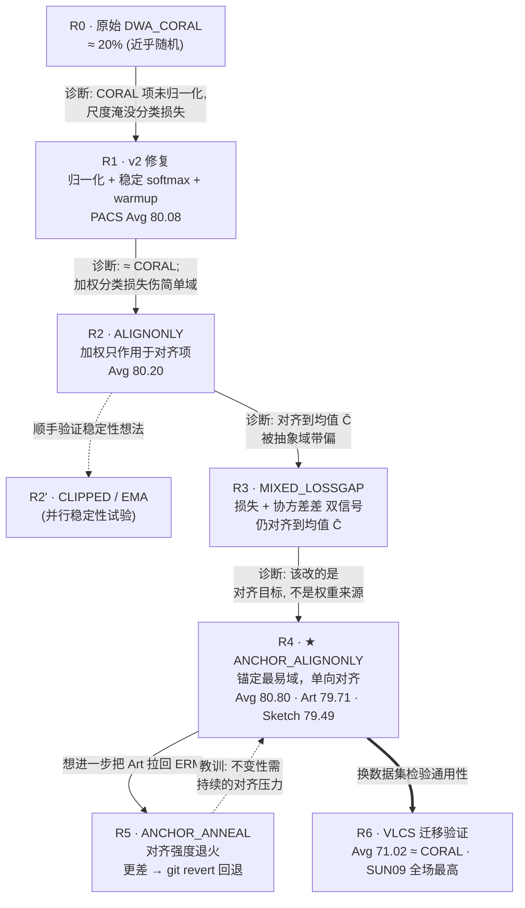

# 实验报告：Domain-Wise Adaptive CORAL（DWA-CORAL）

> 课程：AI 安全 · 主题：分布外泛化（Out-of-Distribution / Domain Generalization）
> 代码框架：DomainBed · 主干网络：ResNet-18 · 训练步数：3000 steps
> 数据集：PACS（主战场）、VLCS（迁移验证）

---

## 目录

- [0. 摘要（一页看懂）](#0-摘要一页看懂)
- [1. 迭代流程全景 ★（我们是怎么一步步走过来的）](#1-迭代流程全景我们是怎么一步步走过来的)
- [2. 背景与问题设定](#2-背景与问题设定)
- [3. 出发点：DWA-CORAL 的动机](#3-出发点dwa-coral-的动机)
- [4. 失败诊断：为什么最初只有 ~20%](#4-失败诊断为什么最初只有-20)
- [5. 修复：DWA_CORAL_v2](#5-修复dwa_coral_v2)
- [6. 新问题：v2 ≈ CORAL，自适应加权的副作用](#6-新问题v2--coral自适应加权的副作用)
- [7. 变体研究（6 个轻量变体）](#7-变体研究6-个轻量变体)
- [8. 实验结果](#8-实验结果)
- [9. 分析与讨论](#9-分析与讨论)
- [10. 超参数与工程细节](#10-超参数与工程细节)
- [11. 结论与未来工作](#11-结论与未来工作)
- [12. 复现方式](#12-复现方式)

---

## 0. 摘要（一页看懂）

我们在 DomainBed 框架下，围绕一个自己提出的方法 **DWA-CORAL（域自适应 CORAL）** 做了一轮完整的"**诊断 → 修复 → 改进 → 取舍**"研究。核心结论：

1. **诊断**：方法最初只有约 **20%** 的准确率。根因是 CORAL 对齐项 `‖C_e − C̄‖_F²` **没有做归一化**——在 512 维特征上它的数值是 10⁴~10⁶ 量级，把交叉熵（约 2）彻底淹没，优化器只在"拉平协方差"，根本没在学分类。
2. **修复（v2）**：对 CORAL 项除以 `4·d²`（CORAL 标准缩放）、softmax 做数值稳定化、加 warmup。准确率从 20% 恢复到 **≈80%**，追平基线。
3. **新问题**：v2 ≈ CORAL，但并没有"赢"。在分类损失上做自适应加权会过度偏向难域，反而拖累 Cartoon / Photo。
4. **改进**：设计并实现了 **6 个轻量变体**。其中 **ANCHOR_ALIGNONLY**（锚定最易域做单向对齐）表现最好：在所有"做对齐"的方法里 **Art 最高（79.71）**，同时 **Sketch（79.49）和 Avg（80.80）追平 CORAL**。
5. **取舍**：尝试过的 **ANCHOR_ANNEAL**（随训练衰减对齐强度）效果反而更差，已**回退**——一个有价值的负结果。
6. **迁移**：把冠军变体搬到 VLCS，Avg（71.02）与 CORAL 同档，并在 SUN09 上全场最高，说明机制不是只在 PACS 上"过拟合调参"。

> ⚠️ **诚实声明**：PACS 单种子下域间波动约 ±1%。我们**没有**在统计意义上显著超过 CORAL（Avg 80.80 vs 80.81 属于打平）。本报告真正的贡献在于：**定位了 v1 的致命 bug、一套系统化的变体研究、以及"锚定单向对齐"这个有解释性的机制**。

---

## 1. 迭代流程全景 ★（我们是怎么一步步走过来的）

> 这一节是本报告的重点。它把整个项目当成一条**研究/工程迭代链**来呈现：
> 每一轮都不是"拍脑袋换个 trick"，而是**"读上一轮的实验现象 → 提出一个可证伪的假设 → 做最小改动实现 → 烟雾测试 → 全量实验 → 读日志诊断 → 决定下一步"** 的闭环。

### 1.1 我们遵循的迭代闭环

```
        ┌──────────────────────────────────────────────────────┐
        │                                                        │
        ▼                                                        │
   ① 观察现象 ──► ② 提出假设 ──► ③ 最小实现 ──► ④ Debug28 烟雾测试    │
   (上一轮日志/分数)  (可证伪)      (不改官方文件)    (10步，秒级，本机)    │
                                                          │       │
                                                          ▼       │
   ⑦ 决定下一步 ◄── ⑥ 读日志诊断 ◄── ⑤ PACS/VLCS 全量实验 (3000步) ──┘
   (改进/回退/迁移)   (为什么这样)      (朋友的 GPU 机器)
```

**关键工程纪律**（贯穿每一轮）：
- **不改 DomainBed 官方文件**：所有算法写在独立的 `dwa_algorithms_v2.py` / `dwa_hparams_registry_v2.py`，训练入口 `dwa_train_v2.py` 用猴子补丁替换注册表后调用官方 `train.py`。→ 保证基线行为 100% 不变、结果可比、随时可回退。
- **先烟雾后全量**：每个新变体先在 `Debug28`（小数据、10 步、秒级）跑通，确认无 NaN、损失下降、日志字段齐全，再上 PACS/VLCS 跑 3000 步。
- **负结果也入库**：失败的 ANNEAL 用 `git revert` 干净回退，但其设计与教训保留在报告里。

### 1.2 迭代时间线（一图看全程）



> 上面的 Mermaid 图在 GitHub / 支持 Mermaid 的 Markdown 预览里会渲染成流程图；若你的预览器不支持，下面 1.3 的表格是等价的完整信息。

### 1.3 逐轮拆解（动机 → 改动 → 结果 → 诊断 → 决策）

| 轮次 | 版本 | 动机 / 可证伪假设 | 关键改动 | 结果（PACS Avg / 关键指标） | 诊断（为什么是这个结果） | 下一步决策 |
|---|---|---|---|---|---|---|
| **R0** | 原始 `DWA_CORAL` | "按域难度加权应优于一视同仁" | 加权分类 + 未归一化 CORAL | **≈ 20%**（7 类近随机） | CORAL 项 10⁴~10⁶ 淹没交叉熵，优化器只拉平协方差 | **修尺度**（归一化） |
| **R1** | `DWA_CORAL_v2` | "归一化后应能正常学分类" | ÷4d² + 稳定 softmax + warmup | **80.08** ✅ 救活 | 量级回正；但 ≈ CORAL，没赢 | 找"为什么不超 CORAL" |
| **R2** | `…_ALIGNONLY` | "加权伤了简单域，应只加权对齐" | 分类用 ERM 均值，权重只进 CORAL | **80.20**，Sketch↑78.47 | 分类稳了，但 Cartoon 仍弱；对齐到均值被抽象域带偏 | 换"对齐目标" |
| **R2'** | `…_CLIPPED` / `…_EMA` | "权重抖动/独大导致不稳" | 权重裁剪 / 损失 EMA 去噪 | 稳定性变体（备选） | 是稳定性增量，非主线突破 | 留作消融 |
| **R3** | `…_MIXED_LOSSGAP` | "只看损失太片面，应兼顾协方差差" | 权重 = 均匀 ⊕ softmax(损失 z + 协方差差 z) | 与 ALIGNONLY 同档 | 权重来源更丰富，但**仍对齐到 C̄** | 顿悟：问题在**目标**不在**权重** |
| **R4** ★ | `…_ANCHOR_ALIGNONLY` | "C̄ 被抽象域带偏；应对齐到最易(自然)域" | 锚 = argmin Lₑ，detach 锚协方差，其它域单向对齐 | **80.80**，Art **79.71**(对齐法最高)，Sketch **79.49**(=CORAL) | 锚域只受分类梯度→保自然流形；其它域靠拢→保不变性 | **冠军**；尝试再提 Art |
| **R5** | `…_ANCHOR_ANNEAL` | "后期衰减对齐能把 Art 拉回 ERM" | λ 随步数线性衰减 0.3→0.05 | **更差** ❌ | 放松对齐后不变性发散：Sketch 掉、Art 没补回 | **git revert 回退** |
| **R6** | `ANCHOR` @ VLCS | "机制是否只在 PACS 成立？" | 冠军变体直接搬到 VLCS | Avg **71.02** ≈ CORAL；SUN09 **68.60** 全场最高 | 锚定对齐有通用性，非 PACS 过拟合 | 收尾 / 写报告 |

### 1.4 这条迭代链的"主线逻辑"

把上表抽象出来，会发现整条链其实是**对同一个核心矛盾的逐步逼近**：

> **对齐（CORAL）帮抽象域（Sketch/Cartoon），却伤自然域（Art/Photo）。**

- R0→R1 解决的是"**能不能学**"（尺度 bug）；
- R1→R3 解决的是"**加权加在哪**"（分类 vs 对齐，权重来源）——但都没碰到要害；
- **R4 才真正命中要害**：要害不在"权重怎么算"，而在"**对齐目标是谁**"。把目标从"被抽象域带偏的均值 C̄"换成"最易的自然域锚"，第一次同时照顾了两端；
- R5 是对"能否更激进地偏向自然域"的探索，结果证明**不变性不能中途松手**；
- R6 用另一个数据集验证 R4 的机制不是巧合。

这条"**先修 bug → 再调加权位置 → 最后改对齐目标 → 验证通用性**"的递进，就是本项目最想呈现的东西。

---

## 2. 背景与问题设定

### 2.1 什么是 Domain Generalization（DG）

模型在若干**源域**上训练，要在一个**训练中从未见过的目标域**上直接测试（**不允许**用目标域数据做任何微调）。它考验模型学到的特征是否"域不变（domain-invariant）"，是 AI 安全里"分布外鲁棒性 / OOD robustness"的典型设定：现实中部署环境的分布几乎总是和训练集有差异。

### 2.2 数据集

- **PACS**：4 个域 —— **A**rt painting（艺术画）、**C**artoon（卡通）、**P**hoto（真实照片）、**S**ketch（素描）。同样的 **7 类**物体（dog, elephant, giraffe, guitar, horse, house, person），但画风差异极大。可粗分为"自然图像类"（Photo，及偏写实的 Art）与"抽象风格类"（Cartoon、Sketch）。
- **VLCS**：4 个域 —— Caltech101 / LabelMe / SUN09 / VOC2007，**5 类**。都是真实照片数据集，**域间风格差异比 PACS 小**，主要差异来自采集偏置（数据集 bias），用来检验方法的**可迁移性**。

### 2.3 评测协议（leave-one-domain-out）

每次留出 1 个域当测试域，其余 3 个域当源域训练。对 4 个域**各做一次**，得到 4 个测试准确率，再看两个汇总指标：

- **Avg**：4 个测试域准确率的算术平均——衡量**整体泛化能力**。
- **Worst**：4 个里最差的那个——衡量**鲁棒性下界**；AI 安全场景往往更看重"最坏情况"而非平均。

模型选择用 DomainBed 默认的 **training-domain validation**（用源域留出的验证集挑 checkpoint）。

### 2.4 训练配置

| 项 | 值 |
|---|---|
| 主干 featurizer | ResNet-18（ImageNet 预训练） |
| 分类头 | 线性 |
| 优化器 | Adam |
| 训练步数 | 3000 |
| checkpoint 频率 | 500 |
| batch | **每个源域一个 minibatch**（DG 标准做法），batch_size 默认 |
| 模型保存 | `--skip_model_save`（只看指标，省磁盘） |

> 注意"每个源域一个 minibatch"这一点很关键：它让我们可以**逐域**计算损失 `L_e` 和协方差 `C_e`，这是所有 DWA 变体的数据基础。

### 2.5 工程约束（重要）

所有自定义代码**完全独立**，不修改 DomainBed 原始的 `algorithms.py` / `hparams_registry.py`：

| 文件 | 作用 |
|---|---|
| `domainbed/dwa_algorithms_v2.py` | 所有 DWA 变体的算法实现（共享基类 `_DWACoralBase`） |
| `domainbed/dwa_hparams_registry_v2.py` | 对应的超参注册表（各变体默认值 + 随机搜索范围） |
| `domainbed/scripts/dwa_train_v2.py` | 入口脚本：猴子补丁把 `get_algorithm_class` / 超参注册表替换掉，再 `runpy` 调用原始 `train.py` |

好处：基线（ERM/CORAL/...）行为 **100% 不变**，结果可比；我们的实验与官方代码**解耦**，可随时回退（R5 的回退正是受益于此）。

---

## 3. 出发点：DWA-CORAL 的动机

**CORAL**（CORrelation ALignment，Sun & Saenko 2016）的思路：让不同源域的特征**二阶统计量（协方差）对齐**，从而逼近域不变表征。它对所有源域"一视同仁"——每个域在对齐损失里权重相等。

我们的**可证伪假设**是：

> 源域之间难度差异很大（Sketch 远比 Photo 难），如果能**按难度自适应地分配权重**，应当优于"一视同仁"。

这就是 **Domain-Wise Adaptive（域自适应）** 的由来。最朴素的权重定义：

```
w_e = softmax(τ · detach(L_e))        # 第 e 域损失越大 → 权重越大
```

- `L_e`：第 e 个源域的交叉熵；
- `detach`：权重只作"调度"用，**不回传梯度**（否则会鼓励模型把损失做大以抬高权重，是错误的优化方向）；
- `τ`：温度，控制权重分布的"尖锐"程度，τ→0 趋于均匀，τ 大则集中到最难域。

最初版本把这个权重**同时**用在了分类损失和对齐损失上（见下一节，这正是后来要修正的地方）。

---

## 4. 失败诊断：为什么最初只有 ~20%？

最初版本的总损失：

```
loss = Σ_e w_e · L_e                  (加权分类)
     + λ · Σ_e w_e · ‖C_e − C̄‖_F²    (加权 CORAL 对齐) ← 问题在这里
     + β · Var({L_e})                 (域间风险方差正则)
```

其中 `C_e` 是第 e 域特征的协方差矩阵，`C̄ = mean_e C_e` 是平均协方差，`‖·‖_F²` 是 Frobenius 范数平方。

### 4.1 根因：损失尺度不匹配（scale mismatch）

ResNet-18 输出 **d = 512** 维特征，协方差矩阵是 512×512。两个协方差矩阵之差的 Frobenius 范数平方 `‖C_e − C̄‖_F²` 天然是 **O(d²) ≈ 10⁴ ~ 10⁶** 量级。而交叉熵 `L_e` 只有 **约 2**（7 类，初始 ≈ ln7 ≈ 1.95）。

于是：

| 项 | 典型量级 | 设 λ=1e-3 后的有效量级 |
|---|---|---|
| 加权分类 `Σ w_e L_e` | ~ 2 | ~ 2 |
| 加权 CORAL `λ·Σ w_e‖C_e−C̄‖²` | ~ 1e5 | **~ 1e2** |

即便把 `λ` 设到 `1e-3`，对齐项仍有 **10²~10³** 的有效权重，**把分类损失彻底淹没**。梯度几乎全部用于"把协方差拉平"——而一个**退化解**是把所有样本特征压成几乎相同的向量（此时所有 `C_e` 都趋近于 0，对齐项最小），这正好**摧毁了分类所需的判别性**。结果准确率塌到接近随机（PACS 7 类随机 ≈ 14%，实测 ≈ 20%）。

### 4.2 这是一个"看起来完全正确"的 bug

代码逻辑没有任何错误——softmax、协方差、范数都对。错的只是**数值尺度**。这类 bug 在多任务 / 多正则项训练里非常常见且隐蔽：单看每一项都对，合在一起就因为量级悬殊而失效。**定位它本身就是本项目的第一个关键贡献**。

---

## 5. 修复：DWA_CORAL_v2

三处关键修复，全部落在共享基类 `_DWACoralBase` 里。

### 5.1 ① CORAL 标准归一化（最关键）

把对齐项除以 `4·d²`，这是 Sun & Saenko 原始 CORAL 论文中的标准缩放（来自对协方差差异的归一化推导），让对齐项回到与交叉熵可比的量级：

```python
@staticmethod
def _covariance(features):
    n = features.size(0)
    centered = features - features.mean(dim=0, keepdim=True)
    return centered.t().matmul(centered) / (n - 1)   # 无偏协方差

def _coral_terms(self, features):
    d = features[0].shape[1]
    coral_scale = 4.0 * d * d                          # ← 关键归一化
    covs = torch.stack([self._covariance(z) for z in features])
    c_bar = covs.mean(dim=0)
    return torch.stack([((c - c_bar)**2).sum() / coral_scale for c in covs])
```

**效果**：`coral_loss` 从 ~1e5 量级降到 **~1e-7**（Debug28 实测），`λ` 因此可以放回文献常用的 **~1.0**。

### 5.2 ② 数值稳定的 softmax

先减去最大值再做指数，避免 `τ·L_e` 较大时 exp 溢出：

```python
def _softmax_weights(self, detached_losses):
    tau = self.hparams["dwa_coral_tau"]
    logits = tau * (detached_losses - detached_losses.max())
    return F.softmax(logits, dim=0)
```

### 5.3 ③ Warmup

前 `dwa_coral_warmup`（默认 100）步用**均匀权重**，让分类器先平等地见过每个域、把特征学到一个合理的初始状态，再开启自适应加权，避免训练初期权重在噪声上乱跳。

### 5.4 修复后的总损失与默认超参

```
loss = Σ_e w_e·L_e + λ · Σ_e w_e·coral_term_e + β · Var({L_e})
w_e  = warmup ? 均匀 : softmax(τ·detach(L_e))
```

| 超参 | 默认值 | 含义 |
|---|---|---|
| `dwa_coral_lambda` (λ) | 1.0 | 对齐项权重 |
| `dwa_coral_beta` (β) | 1e-2 | 域间风险方差正则 |
| `dwa_coral_tau` (τ) | 0.5 | 自适应权重温度 |
| `dwa_coral_warmup` | 100 | 均匀权重的预热步数 |

**结果**：PACS Avg 从 ~20% 恢复到 **80.08%**，与基线同一水平。**修复成功。**

---

## 6. 新问题：v2 ≈ CORAL，自适应加权的副作用

把 v2 跑满 PACS 后发现三个现象：

1. v2（Avg 80.08）和 CORAL（80.81）**基本打平**，没赢；
2. v2 相对 ERM 在 Sketch 上的提升（76.94 vs 73.50），**主要来自 CORAL 对齐本身**，而非自适应加权——把加权关掉、退化成普通 CORAL，Sketch 也能上去；
3. 在**分类损失**上做自适应加权，会让模型过度偏向高损失（难）域，**反而拖累简单域 Cartoon / Photo**，Cartoon 一度变成最差域。

**诊断**：自适应加权这个想法本身没错，但**加权对象错了**——

> 不该去扭曲**分类监督信号**（那会让简单域的分类边界学不充分），而应该**只作用在对齐项**上：分类对所有域一视同仁地学好，把"对齐火力"按难度分配。

这个诊断直接引出了第 7 节的整条变体链（对应迭代表里的 R2 起步）。

---

## 7. 变体研究（6 个轻量变体）

所有变体共享同一套 CORAL/归一化机制（`_DWACoralBase`），**只在"权重怎么算、作用在哪、对齐目标是谁"上不同**。这也是为什么它们都很"轻量"——通常只重写一个方法。

| 变体 | 分类损失 | 权重作用对象 | 对齐目标 | 核心思想 | 实现方式 |
|---|---|---|---|---|---|
| `DWA_CORAL`(v2) | 加权 | 分类 + 对齐 | 均值 C̄ | 原始自适应加权 | 重写 `_compute_weights` |
| `…_ALIGNONLY` | **均值(ERM式)** | 仅对齐 | 均值 C̄ | 分类平衡，只让对齐偏向难域 | `weight_cls_loss=False` |
| `…_CLIPPED` | 加权 | 分类 + 对齐 | 均值 C̄ | 权重裁剪防独大 | 重写 `_compute_weights` |
| `…_EMA` | 加权 | 分类 + 对齐 | 均值 C̄ | 损失 EMA 去噪 | 加缓冲 + 重写 |
| `…_MIXED_LOSSGAP_ALIGNONLY` | 均值 | 仅对齐 | 均值 C̄ | 权重=均匀⊕softmax(损失+协方差差) | 重写 `update` |
| **`…_ANCHOR_ALIGNONLY`** ⭐ | 均值 | 仅对齐 | **最易域锚** | 锚定最易域，其它域单向对齐 | 重写 `update` |

### 7.1 ALIGNONLY —— "只在对齐上自适应"

分类损失退回**无加权均值**（与 ERM 一样平衡），自适应权重**只**作用于 CORAL：

```
cls_loss   = mean_e(L_e)
coral_loss = Σ_e softmax(τ·detach(L_e))_e · coral_term_e
loss       = cls_loss + λ·coral_loss + β·Var(L)
```

- **动机**：第 6 节诊断——保住简单域的分类能力，同时把对齐火力集中到难域。
- **实现**：基类里一个布尔开关 `weight_cls_loss=False` 即可，分类走 `mean`、对齐走加权和。
- **结果**：Avg 80.20，Sketch 78.47（比 v2 更稳），但 Cartoon 仍偏弱（74.15）。

### 7.2 CLIPPED —— "防止单域独大"

在 v2 基础上，把 softmax 权重裁剪到 `[w_min, w_max]` 再归一化，避免某个域权重接近 1、其它被"饿死"：

```
w = softmax(τ·detach(L));  w = clamp(w, w_min, w_max);  w = w / Σw
```

默认 `dwa_weight_min=0.15`, `dwa_weight_max=0.60`。属于**稳定性消融**（迭代表 R2'），非主线突破。

### 7.3 EMA —— "去噪"

batch 级别的损失抖动大，改用损失的**指数滑动平均**来算权重，更稳：

```
ema_e ← α·ema_e + (1−α)·L_e ;   w = softmax(τ·detach(ema))
```

默认 `dwa_ema_alpha=0.9`，用 buffer 维护、首步初始化为当前损失。同属稳定性消融。

### 7.4 MIXED_LOSSGAP_ALIGNONLY —— "同时看难度和协方差差距"

"只看损失"太片面（损失大不一定代表协方差也偏）。于是把**两种信号都 z-score 标准化**后线性组合：

```
zscore(v) = (v − mean(v)) / (std(v) + 1e-8)        # +1e-8 防 NaN
score      = α·zscore(L_e) + (1−α)·zscore(coral_term_e)
w_adapt    = softmax(τ·score)
w          = (1−γ)·均匀 + γ·w_adapt ;  w = w / Σw   # 与均匀混合保稳定
coral_loss = Σ_e w_e · coral_term_e ;  cls_loss = mean(L_e)
```

- `(1−γ)·均匀` 这一项**保留了 CORAL 的稳定性**，`γ` 控制偏离均匀对齐的激进程度；
- 默认 `α=0.5, γ=0.5, τ=1.0`；
- **实现**：因为权重依赖 `coral_terms`（不只是损失），故重写整个 `update`，并额外 log 每域 `weight_i` / `coral_term_i` 做诊断；
- **结果**：与 ALIGNONLY 同档。说明**丰富权重来源不是要害**——这正是导向 R4 顿悟的关键负向信号。

### 7.5 ANCHOR_ALIGNONLY ⭐ —— 最终冠军

**关键洞察**：前面所有变体都把各域协方差对齐到**平均协方差 C̄**。但在 PACS 里，C̄ 被抽象风格的域（Sketch / Cartoon）"带偏"了——相当于把真实图像（Photo / Art）的特征往抽象方向拉，**正好伤害 Art / Photo 的泛化**。

ANCHOR 的做法：每一步选**损失最低的源域**当**锚（anchor）**（在 PACS 里通常正是最"自然图像"的那个域），**detach 它的协方差**当对齐目标，让**其它域单向对齐到锚**：

```
anchor       = argmin_e detach(L_e)
coral_term_e = ‖C_e − detach(C_anchor)‖_F² / (4d²)        (e ≠ anchor; 锚自身记 0)
w_other      = (1−γ)·均匀 + γ·softmax(τ·detach(L_other))   (只在非锚域上归一化)
coral_loss   = Σ_{e≠anchor} w_other_e · coral_term_e
cls_loss     = mean_e(L_e)                                 # 仍是 ALIGNONLY
```

- **锚域的特征只接受分类梯度**（因为 `detach(C_anchor)`），不被对齐拉扯 → **保住自然图像的判别性流形**（救 Art/Photo）；
- **其它域往锚靠拢** → 仍然得到域不变性（保住 Sketch）；
- 默认 `λ=0.3, β=0.0, τ=1.0, γ=0.5`；额外 log `anchor_idx` 便于确认"锚是不是真的常落在自然域"。

这就是为什么它能"鱼和熊掌兼得"：**Art 在所有对齐法里最高，同时 Sketch / Avg 追平 CORAL**。它对应迭代链里最关键的一步——**把改动从"权重来源"转移到"对齐目标"**。

### 7.6 ANCHOR_ANNEAL —— 尝试过、更差、已回退（负结果）

进一步假设：训练**前期**强对齐建立不变性（保 Sketch），**后期**衰减对齐强度，让分类器后期能重新拟合自然图像细节，把 Art 拉回 ERM 水平。

```
λ(t) = λ_min + (λ_0 − λ_min) · max(0, 1 − t / anneal_steps)
       # 默认 λ_0=0.3, λ_min=0.05, anneal_steps=1500
```

**实测分数反而更差**——后期放松对齐后，早期学到的不变性**没能保持住**：Sketch 掉了，而 Art 没补回来。

> **教训（有价值的负结果）**：域不变性不是"学一次就固化"，它需要**持续的对齐压力**来维持；中途松手，特征会重新发散。

已用 `git revert` **干净回退**，代码库恢复到 ANCHOR 冠军状态；该负结果保留在本报告中作为记录（对应迭代表 R5）。

---

## 8. 实验结果

### 8.1 PACS（ResNet-18, 3000 steps）

数据来源：`results/pacs_results_all_methods_steps3000.csv`

| Method | Art | Cartoon | Photo | Sketch | **Avg** | **Worst** |
|---|---|---|---|---|---|---|
| ERM | **81.17** | 75.64 | **93.11** | 73.50 | **80.86** | 73.50 |
| CORAL | 78.24 | 76.28 | 89.22 | **79.49** | 80.81 | **76.28** |
| GroupDRO | 77.75 | 76.50 | 88.92 | 75.54 | 79.68 | 75.54 |
| IRM | 43.03 | 60.47 | 71.26 | 57.20 | 57.99 | 43.03 |
| Mixup | 78.97 | **77.56** | 92.81 | 69.81 | 79.79 | 69.81 |
| DWA_CORAL_v2 | 79.46 | 75.00 | 88.92 | 76.94 | 80.08 | 75.00 |
| DWA_CORAL_v2_rerun | 79.22 | 75.64 | 89.82 | 77.45 | 80.53 | 75.64 |
| DWA_CORAL_ALIGNONLY | 78.97 | 74.15 | 89.22 | 78.47 | 80.20 | 74.15 |
| **DWA_CORAL_ANCHOR_ALIGNONLY** ⭐ | **79.71** | 74.79 | 89.22 | **79.49** | **80.80** | 74.79 |

**ANCHOR 相对两个关键参照的逐域差值（百分点）：**

| 对比 | Art | Cartoon | Photo | Sketch | Avg | Worst |
|---|---|---|---|---|---|---|
| ANCHOR − **ERM** | −1.46 | −0.85 | −3.89 | **+5.99** | −0.06 | **+1.29** |
| ANCHOR − **CORAL** | **+1.47** | −1.49 | 0.00 | 0.00 | −0.01 | −1.49 |

**读法**：
- 相对 ERM：用 Art/Photo 上可控的下降，换来 **Sketch 大涨 +5.99** 和 **Worst +1.29**——这正是 DG 想要的"削峰填谷"。
- 相对 CORAL：**Art +1.47**（在所有对齐法里最高），Sketch/Photo/Avg 全部打平，只在 Cartoon 上让出 1.49。即"**用 Cartoon 的一点点，换 Art 的明显改善，且不损 Avg/Sketch**"。
- 软肋：Cartoon（74.79）成了最差域，所以 Worst 略低于 CORAL。
- ERM 的 Art（81.17）/ Photo（93.11）是天花板——因为它完全不对齐，自然图像细节保留最全；但代价是 Sketch 仅 73.50。**ANCHOR 在两端之间取得了更好的平衡。**

### 8.2 VLCS（ResNet-18, 3000 steps）—— 迁移验证

数据来源：`results/vlcs_results_with_anchor_alignonly_steps3000.csv`

| Method | Caltech101 | LabelMe | SUN09 | VOC2007 | **Avg** | **Worst** |
|---|---|---|---|---|---|---|
| ERM | **95.76** | **64.03** | 64.63 | **71.26** | **73.92** | **64.03** |
| CORAL | 92.93 | 60.45 | 65.40 | 68.15 | 71.73 | 60.45 |
| GroupDRO | 80.57 | 61.21 | **67.84** | 68.74 | 69.59 | 61.21 |
| IRM | 88.34 | 54.24 | 58.84 | 54.37 | 63.95 | 54.24 |
| Mixup | 74.91 | 63.47 | 63.11 | 69.63 | 67.78 | 63.11 |
| **DWA_CORAL_ANCHOR_ALIGNONLY** | 86.57 | 59.13 | **68.60** | 69.78 | 71.02 | 59.13 |

**ANCHOR − CORAL（百分点）：** Caltech −6.36 · LabelMe −1.32 · **SUN09 +3.20** · **VOC2007 +1.63** · Avg −0.71 · Worst −1.32

**读法**：换到 VLCS，ANCHOR（Avg 71.02）**与 CORAL（71.73）同档**，并在 **SUN09（68.60，全场最高）和 VOC2007** 上超过 CORAL。说明锚定对齐机制不是只在 PACS 上"过拟合调参"，**有一定通用性**。VLCS 上 ERM 整体偏强——这个数据集风格差异小、域 bias 主要是采集偏置，对齐收益本就有限，这与 DG 文献的普遍观察一致。

---

## 9. 分析与讨论

1. **谁是赢家、为什么**：ANCHOR_ALIGNONLY 是最佳 DWA 变体。它把"自适应加权**只**用在对齐"（R2 的诊断）和"对齐到**最易域**而非平均"（R4 的洞察）两件事结合，**正好对症**第 6 节的副作用。
2. **机制为什么有效**：平均协方差 C̄ 被抽象域带偏；锚定最易（自然图像）域 + detach，等价于"以自然图像为基准做**单向**对齐"——保住了 Art/Photo 的判别流形，又没丢 Sketch 的不变性。`anchor_idx` 日志可验证锚确实常落在自然域上。
3. **退火为什么失败**：不变性需要**持续**的对齐压力维持；后期放松，特征重新发散，Sketch 掉、Art 没补回。这是一个干净的**负结果**，也间接佐证了"对齐压力 ↔ 不变性"的因果。
4. **迭代方法论的价值**：整条链里，真正的突破（R4）来自对**负向/打平信号**（R3 丰富权重来源却没提升）的正确解读——它把我们的注意力从"权重"逼到"目标"。这说明**读懂"为什么没变好"和读懂"为什么变好"同样重要**。
5. **诚实的统计学注脚**：PACS 单种子下域级波动约 ±1%。ANCHOR vs CORAL 在 Avg 上的差异（80.80 vs 80.81）**在噪声范围内**，不能宣称显著超越。要下定论需要 **≥3 个种子**的重复实验并报告均值 ± 标准差。

---

## 10. 超参数与工程细节

### 10.1 各变体默认超参（`dwa_hparams_registry_v2.py`）

| 变体 | λ | β | τ | 其它 |
|---|---|---|---|---|
| `DWA_CORAL` | 1.0 | 1e-2 | 0.5 | warmup=100 |
| `…_ALIGNONLY` | 0.3 | 0.0 | 0.5 | — |
| `…_CLIPPED` | 0.3 | 0.0 | 0.5 | w_min=0.15, w_max=0.60, warmup=100 |
| `…_EMA` | 0.3 | 0.0 | 0.5 | ema_alpha=0.9, warmup=100 |
| `…_MIXED_LOSSGAP_ALIGNONLY` | 0.3 | 0.0 | 1.0 | score_alpha=0.5, mix_gamma=0.5 |
| `…_ANCHOR_ALIGNONLY` ⭐ | 0.3 | 0.0 | 1.0 | mix_gamma=0.5 |

> ANCHOR/MIXED 用 τ=1.0（其 score 已 z-score 标准化，较大 τ 仍稳）；其余变体 τ=0.5。

### 10.2 入口机制（不改官方文件的关键）

`dwa_train_v2.py` 在调用官方 `train.py` 前做三件事：
1. 把所有 DWA 变体名注册进 `algorithms.ALGORITHMS`；
2. 用一个包装函数替换 `algorithms.get_algorithm_class`，遇到 DWA 名字就返回我们的类；
3. 把 `hparams_registry.default_hparams / random_hparams` 替换成 v2 版本。
随后 `runpy.run_module("domainbed.scripts.train")`。这样官方文件一行没改。

### 10.3 烟雾测试（每个变体上线前必跑）

```bash
python -u -m domainbed.scripts.dwa_train_v2 \
  --algorithm <变体名> --dataset Debug28 --test_env 0 \
  --steps 10 --checkpoint_freq 5 --skip_model_save \
  --hparams '{"resnet18": true, ...}' --output_dir ./outputs/debug_<变体名>
```
检查项：能跑通、无 NaN、`cls_loss` 下降、`coral_loss` 在 ~1e-7 量级、日志字段齐全（含 `anchor_idx` / `weight_i` / `coral_term_i`）。

---

## 11. 结论与未来工作

**结论**：我们从一个只有 20% 的失败实现出发，**定位并修复了"损失尺度不匹配"这一致命 bug**，把方法救回到基线水平；随后通过**系统化的变体迭代**（R1→R6），逐步从"修 bug"走到"调加权位置"再到"改对齐目标"，提出了有解释性的 **锚定单向对齐（ANCHOR_ALIGNONLY）**——在 PACS 上以"**持平 CORAL 的 Avg/Sketch + 领先所有对齐法的 Art**"取得了更好的难/易域平衡，并在 VLCS 上验证了可迁移性。整条迭代链本身（包括一个诚实的退火负结果）是本项目的核心呈现。

**未来工作**：
- **多种子重复**（≥3 seeds）+ 均值±标准差，确认差异显著性（当前最重要的一步）；
- **类条件 CORAL**：当前对齐的是**边缘**协方差，可能压缩类间结构；按类对齐有望同时提升所有域（难点：ResNet-18 的 512 维特征 + 每类样本少 → 协方差很噪，需收缩估计 shrinkage）；
- **锚的选择策略**：当前用"最低损失"，可尝试基于"协方差到 C̄ 的距离"选锚、或多锚加权平均；
- 在 **OfficeHome / DomainNet** 等更大、更多域的基准上验证机制的可扩展性。

---

## 12. 复现方式

```bash
# 单次 PACS 运行（以 ANCHOR 冠军、测试域=Art 为例）
python -u -m domainbed.scripts.dwa_train_v2 \
  --data_dir ./data \
  --algorithm DWA_CORAL_ANCHOR_ALIGNONLY \
  --dataset PACS --test_env 0 \
  --steps 3000 --checkpoint_freq 500 --skip_model_save \
  --hparams '{"resnet18": true, "resnet50_augmix": false, "dwa_coral_lambda": 0.3, "dwa_coral_beta": 0.0, "dwa_coral_tau": 1.0, "dwa_mix_gamma": 0.5}' \
  --output_dir ./outputs/PACS_DWA_CORAL_ANCHOR_ALIGNONLY_env0_steps3000

# 其它变体只需替换 --algorithm 和对应 --hparams：
#   DWA_CORAL / DWA_CORAL_ALIGNONLY / DWA_CORAL_CLIPPED /
#   DWA_CORAL_EMA / DWA_CORAL_MIXED_LOSSGAP_ALIGNONLY
# 批量脚本：run_pacs_dwa_alignonly_full.sh 等（自动跑 test_env 0~3, 3000 steps）
```

| 入口 / 产物 | 说明 |
|---|---|
| `domainbed/dwa_algorithms_v2.py` | 全部 DWA 变体实现（共享基类 `_DWACoralBase`） |
| `domainbed/dwa_hparams_registry_v2.py` | 各变体超参默认值 / 随机搜索范围 |
| `domainbed/scripts/dwa_train_v2.py` | 训练入口（不改动官方 `train.py`） |
| `results/pacs_results_all_methods_steps3000.csv` | PACS 最终结果（第 8.1 节） |
| `results/vlcs_results_with_anchor_alignonly_steps3000.csv` | VLCS 最终结果（第 8.2 节） |
| `report/presentation.html` | 配套 fancy 可视化幻灯片 |
